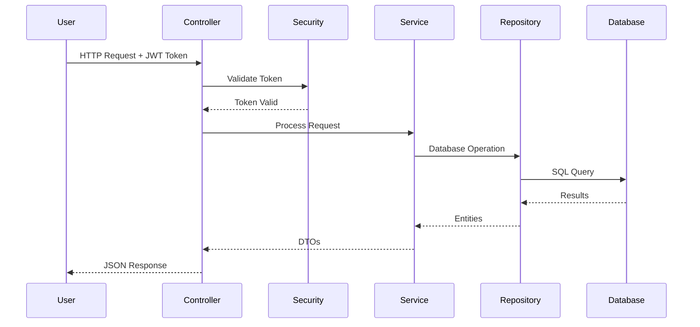
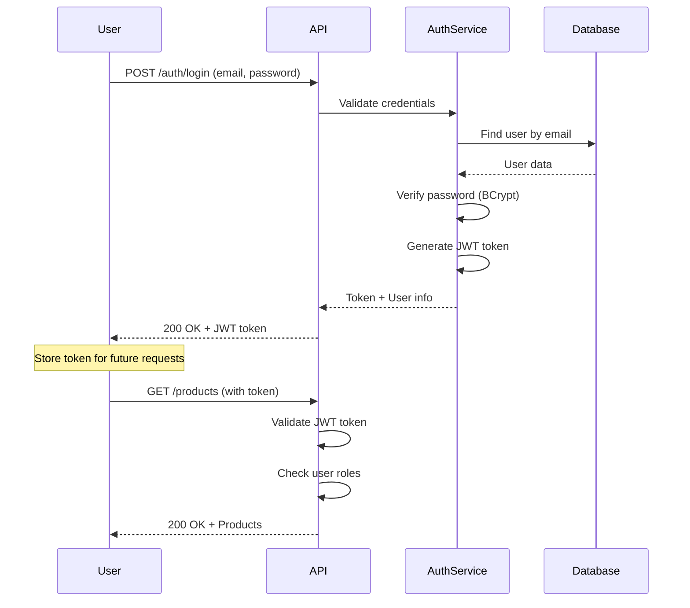

# 🛒 Electronic Store Backend - Complete Documentation

> A production-ready e-commerce backend built with Spring Boot, featuring user management, product catalog, shopping cart, and secure authentication.

## 📋 Table of Contents

- [Overview](#overview)
- [Features](#features)
- [System Architecture](#system-architecture)
- [Database Design](#database-design)
- [API Documentation](#api-documentation)
- [Setup Guide](#setup-guide)
- [Azure Deployment](#azure-deployment)
- [Security](#security)
- [Testing](#testing)

---

## 🎯 Overview

The Electronic Store Backend is a complete REST API for an e-commerce platform. Think of it as the "brain" behind an online shopping website - it handles everything from user accounts to product listings, shopping carts, and orders.

**What This Application Does:**
- Manages user accounts (registration, login, profiles)
- Organizes products into categories
- Handles shopping cart operations
- Processes orders
- Stores and serves product images
- Secures all operations with authentication

---

## ✨ Features

### 👤 User Management
- User registration and login
- Profile management with image upload
- Role-based access (Admin/Customer)
- Password encryption for security

### 📦 Product Management
- Create, update, delete products
- Product categorization
- Product image upload
- Search and filter products
- Pagination support

### 🗂 Category Management
- Organize products by categories
- Category images
- Hierarchical organization

### 🛒 Shopping Cart
- Add/remove items from cart
- Update quantities
- View cart total
- Clear cart

### 🔐 Security
- JWT token-based authentication
- Password encryption with BCrypt
- Role-based authorization
- Secure API endpoints

### 📸 File Management
- Image upload for users, products, and categories
- File storage organization
- Image serving

---

## 🏗 System Architecture

### High-Level Architecture

```
┌──────────────┐
│   Frontend   │ (React/Angular/Mobile App)
│  Application │
└──────┬───────┘
       │ HTTP/REST
       ▼
┌──────────────────────────────────────┐
│     Spring Boot Application          │
│  ┌────────────────────────────────┐  │
│  │   Security Layer (JWT)         │  │
│  └────────────────────────────────┘  │
│  ┌────────────────────────────────┐  │
│  │   REST Controllers             │  │
│  └────────────────────────────────┘  │
│  ┌────────────────────────────────┐  │
│  │   Service Layer                │  │
│  └────────────────────────────────┘  │
│  ┌────────────────────────────────┐  │
│  │   Repository Layer (JPA)       │  │
│  └────────────────────────────────┘  │
└──────────────┬───────────────────────┘
               │
               ▼
        ┌─────────────┐
        │   MySQL     │
        │  Database   │
        └─────────────┘
```

### Request Flow



### Layer Responsibilities

| Layer | Responsibility | Example |
|-------|---------------|---------|
| **Controller** | Handle HTTP requests/responses | `UserController`, `ProductController` |
| **Service** | Business logic | Validate data, calculate totals |
| **Repository** | Database operations | Save, find, delete records |
| **Entity** | Database tables | `User`, `Product`, `Cart` |
| **DTO** | Data transfer objects | `UserDto`, `ProductDto` |

---

## 💾 Database Design

### Entity Relationship Diagram

```
┌─────────────┐         ┌──────────────┐
│    User     │         │   Category   │
├─────────────┤         ├──────────────┤
│ id          │         │ id           │
│ name        │         │ title        │
│ email       │◄───┐    │ description  │
│ password    │    │    │ coverImage   │
│ gender      │    │    └──────┬───────┘
│ about       │    │           │
│ imageName   │    │           │ 1
│ roles       │    │           │
└─────┬───────┘    │           │
      │            │           │
      │ 1          │           │ *
      │            │    ┌──────▼───────┐
      │            │    │   Product    │
      │            │    ├──────────────┤
      │            │    │ id           │
      │            │    │ title        │
      │            └────┤ userId       │
      │                 │ categoryId   │
      │                 │ description  │
      │                 │ price        │
      │                 │ quantity     │
      │                 │ productImage │
      │                 │ live         │
      │                 │ stock        │
      │                 └──────┬───────┘
      │                        │
      │ 1                      │ *
      │                        │
      ▼                        │
┌─────────────┐               │
│    Cart     │               │
├─────────────┤               │
│ id          │               │
│ userId      │               │
│ createdAt   │               │
└─────┬───────┘               │
      │                       │
      │ 1                     │
      │                       │
      │ *                     │
      ▼                       │
┌─────────────┐               │
│  CartItem   │               │
├─────────────┤               │
│ id          │               │
│ cartId      │               │
│ productId   │◄──────────────┘
│ quantity    │
│ totalPrice  │
└─────────────┘
```

### Key Tables

#### Users Table
Stores customer and admin information.
```sql
- id: Unique identifier
- name: User's full name
- email: Login email (unique)
- password: Encrypted password
- roles: User permissions (ADMIN/CUSTOMER)
- imageName: Profile picture filename
```

#### Products Table
Contains all product information.
```sql
- id: Unique identifier
- title: Product name
- description: Product details
- price: Product price
- quantity: Available stock
- categoryId: Link to category
- productImage: Product photo filename
- live: Is product active?
- stock: Is product in stock?
```

#### Cart & CartItems Tables
Manages shopping cart functionality.
```sql
Cart:
- id: Unique identifier
- userId: Owner of the cart
- createdAt: When cart was created

CartItem:
- id: Unique identifier
- cartId: Which cart it belongs to
- productId: Which product
- quantity: How many items
- totalPrice: Calculated price
```

---

## 🔌 API Documentation

### Authentication APIs

#### Register New User
```http
POST /api/users/register
Content-Type: application/json

{
  "name": "John Doe",
  "email": "john@example.com",
  "password": "securePassword123",
  "gender": "Male",
  "about": "Customer"
}
```

#### Login
```http
POST /api/auth/login
Content-Type: application/json

{
  "email": "john@example.com",
  "password": "securePassword123"
}

Response:
{
  "token": "eyJhbGciOiJIUzI1NiIsInR5cCI6IkpXVCJ9...",
  "user": { ... }
}
```

### Product APIs

#### Get All Products
```http
GET /api/products?page=0&size=10&sortBy=title
Authorization: Bearer <token>
```

#### Create Product (Admin Only)
```http
POST /api/products
Authorization: Bearer <token>
Content-Type: application/json

{
  "title": "iPhone 15 Pro",
  "description": "Latest Apple smartphone",
  "price": 999.99,
  "quantity": 50,
  "categoryId": "cat123",
  "live": true,
  "stock": true
}
```

#### Upload Product Image
```http
POST /api/products/{productId}/image
Authorization: Bearer <token>
Content-Type: multipart/form-data

image: <file>
```

### Cart APIs

#### Add Item to Cart
```http
POST /api/carts/{userId}/items
Authorization: Bearer <token>
Content-Type: application/json

{
  "productId": "prod123",
  "quantity": 2
}
```

#### Get User's Cart
```http
GET /api/carts/{userId}
Authorization: Bearer <token>
```

#### Remove Item from Cart
```http
DELETE /api/carts/{userId}/items/{itemId}
Authorization: Bearer <token>
```

### Category APIs

#### Get All Categories
```http
GET /api/categories
Authorization: Bearer <token>
```

#### Create Category (Admin Only)
```http
POST /api/categories
Authorization: Bearer <token>
Content-Type: application/json

{
  "title": "Electronics",
  "description": "Electronic devices and gadgets",
  "coverImage": "electronics.jpg"
}
```

---

## 🚀 Setup Guide

### Prerequisites

- Java 21 or higher
- Maven 3.6+
- MySQL 8.0+
- Docker (optional)

### Step 1: Clone the Repository

```bash
git clone <repository-url>
cd spring-guides/springBasicSamples/electronicStorePorject/electronic-store-backend
```

### Step 2: Setup Database

**Option A: Using Docker (Recommended)**
```bash
docker-compose up -d
```

**Option B: Manual MySQL Setup**
```sql
CREATE DATABASE ElectronicStore;
CREATE USER 'storeuser'@'localhost' IDENTIFIED BY 'password';
GRANT ALL PRIVILEGES ON ElectronicStore.* TO 'storeuser'@'localhost';
```

### Step 3: Configure Application

Edit `src/main/resources/application.properties`:

```properties
# Database Configuration
spring.datasource.url=jdbc:mysql://localhost:3306/ElectronicStore
spring.datasource.username=storeuser
spring.datasource.password=password

# JWT Configuration
jwt.secret=your-secret-key-here
jwt.expiration=86400000

# File Upload
file.upload.dir=./uploads
```

### Step 4: Build and Run

```bash
# Build the project
./mvnw clean install

# Run the application
./mvnw spring-boot:run
```

### Step 5: Access the Application

- **API Base URL:** `http://localhost:8080/api`
- **Swagger UI:** `http://localhost:8080/swagger-ui.html`
- **H2 Console (if using H2):** `http://localhost:8080/h2-console`

### Step 6: Create Admin User

Use the SQL script in `src/main/resources/DBDataForTesting/` or register via API and manually update roles in database.

---

## 🚀 Azure Deployment

### Deploy to Microsoft Azure

This application can be deployed to Azure using Docker containers.

**Deployment Options:**
- Azure Container Instances (Simple, cost-effective)
- Azure App Service (Production-ready, auto-scaling)
- Azure Kubernetes Service (Enterprise-scale)

**What You'll Need:**
- Azure account
- Azure CLI
- Docker
- 30-60 minutes

**Complete Guides:**
- 📚 **[Full Azure Deployment Guide](./AZURE_DEPLOYMENT.md)** - Step-by-step with screenshots
- ⚡ **[Quick Reference](./AZURE_QUICK_REFERENCE.md)** - Command cheat sheet

**Quick Deploy:**
```bash
# 1. Build and push to Azure Container Registry
./mvnw clean package -DskipTests
docker build -t electronic-store-backend:latest .
az acr login --name electronicstoreacr
docker tag electronic-store-backend:latest electronicstoreacr.azurecr.io/electronic-store-backend:v1.0
docker push electronicstoreacr.azurecr.io/electronic-store-backend:v1.0

# 2. Deploy to Azure Container Instance
az container create \
  --resource-group electronic-store-rg \
  --name electronic-store-app \
  --image electronicstoreacr.azurecr.io/electronic-store-backend:v1.0 \
  --dns-name-label electronic-store-app \
  --ports 8080
```

**Deployment Architecture:**
```
Azure Cloud
├── Container Registry (stores images)
├── Container Instance (runs app)
├── MySQL Database (data storage)
└── Blob Storage (file uploads)
```

**See Also:**
- [Deployment Screenshots](./deployment-screenshots/) - Visual guide
- [Azure Documentation](https://docs.microsoft.com/azure/)

---

## 🔐 Security

### Authentication Flow



### Security Features

1. **Password Encryption**
   - Uses BCrypt algorithm
   - Passwords never stored in plain text
   - Salt added automatically

2. **JWT Tokens**
   - Stateless authentication
   - Token contains user info and roles
   - Expires after 24 hours (configurable)

3. **Role-Based Access**
   - ADMIN: Full access to all operations
   - CUSTOMER: Limited to own data

4. **Protected Endpoints**
   - Most endpoints require authentication
   - Admin-only endpoints for management operations

---

## 🧪 Testing

### Using Postman

1. Import collection from `postman/collections/`
2. Set environment variables (base URL, token)
3. Run authentication request first
4. Use returned token for other requests

### Manual Testing with cURL

Available in `src/main/resources/manualTestingCurls/`

Example:
```bash
# Login
curl -X POST http://localhost:8080/api/auth/login \
  -H "Content-Type: application/json" \
  -d '{"email":"admin@store.com","password":"admin123"}'

# Get Products
curl -X GET http://localhost:8080/api/products \
  -H "Authorization: Bearer <your-token>"
```

### Test Data

Sample data available in `src/main/resources/DBDataForTesting/`

---

## 📊 Key Technologies

| Technology | Purpose | Why We Use It |
|------------|---------|---------------|
| **Spring Boot** | Framework | Rapid development, production-ready |
| **Spring Security** | Security | Industry-standard security |
| **Spring Data JPA** | Database | Simplified database operations |
| **MySQL** | Database | Reliable, scalable storage |
| **JWT** | Authentication | Stateless, scalable auth |
| **Lombok** | Code reduction | Less boilerplate code |
| **MapStruct** | Object mapping | Type-safe DTO mapping |
| **Swagger** | Documentation | Interactive API docs |
| **Docker** | Containerization | Easy deployment |

---

## 🎯 Best Practices Implemented

✅ **Layered Architecture** - Clear separation of concerns  
✅ **DTO Pattern** - Separate API models from database entities  
✅ **Exception Handling** - Centralized error handling  
✅ **Input Validation** - Validate all user inputs  
✅ **Security** - JWT + BCrypt + Role-based access  
✅ **API Documentation** - Swagger/OpenAPI  
✅ **Code Quality** - Lombok for clean code  
✅ **Database Design** - Normalized schema with proper relationships  
✅ **File Organization** - Structured package hierarchy  
✅ **Configuration Management** - Externalized configuration  

---

## 🐛 Common Issues & Solutions

### Issue: Database Connection Failed
**Solution:** Check MySQL is running and credentials in `application.properties` are correct.

### Issue: JWT Token Invalid
**Solution:** Token might be expired. Login again to get a new token.

### Issue: File Upload Failed
**Solution:** Ensure `uploads/` directory exists and has write permissions.

### Issue: Port 8080 Already in Use
**Solution:** Change port in `application.properties`: `server.port=8081`

---

## 📈 Future Enhancements

- [ ] Order management system
- [ ] Payment gateway integration
- [ ] Email notifications
- [ ] Product reviews and ratings
- [ ] Wishlist functionality
- [ ] Advanced search with filters
- [ ] Inventory management
- [ ] Analytics dashboard

---

## 🤝 Contributing

Contributions are welcome! Please:
1. Fork the repository
2. Create a feature branch
3. Make your changes
4. Submit a pull request

---

 ## Final application login page : 

