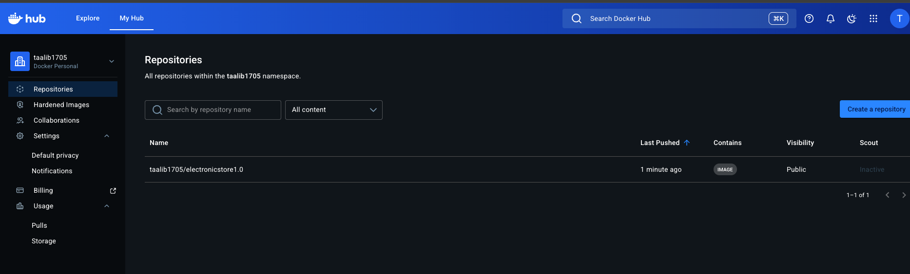
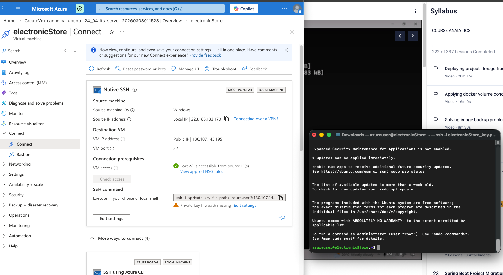
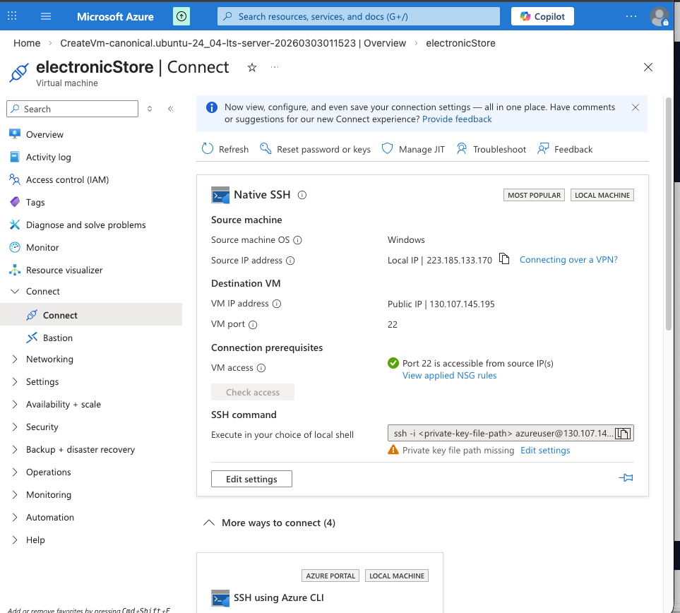
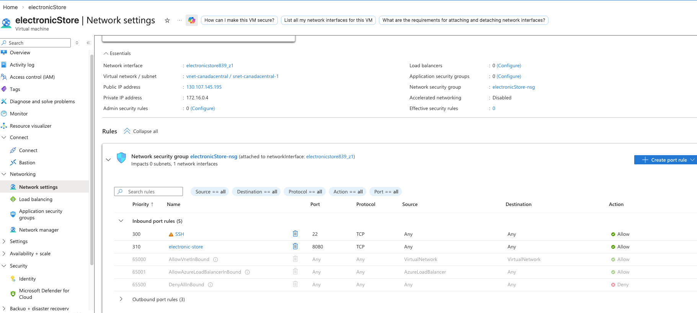
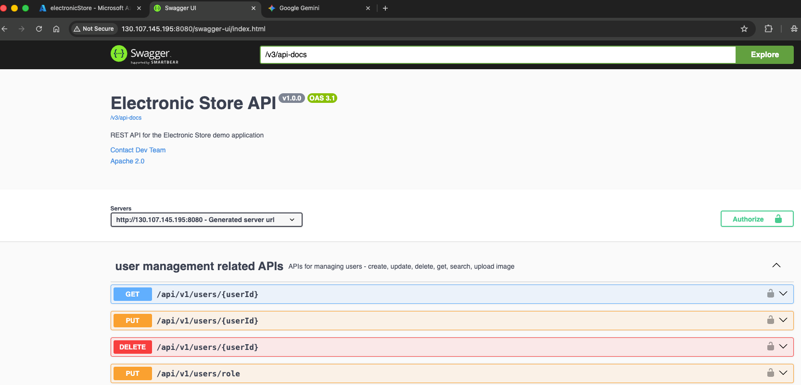
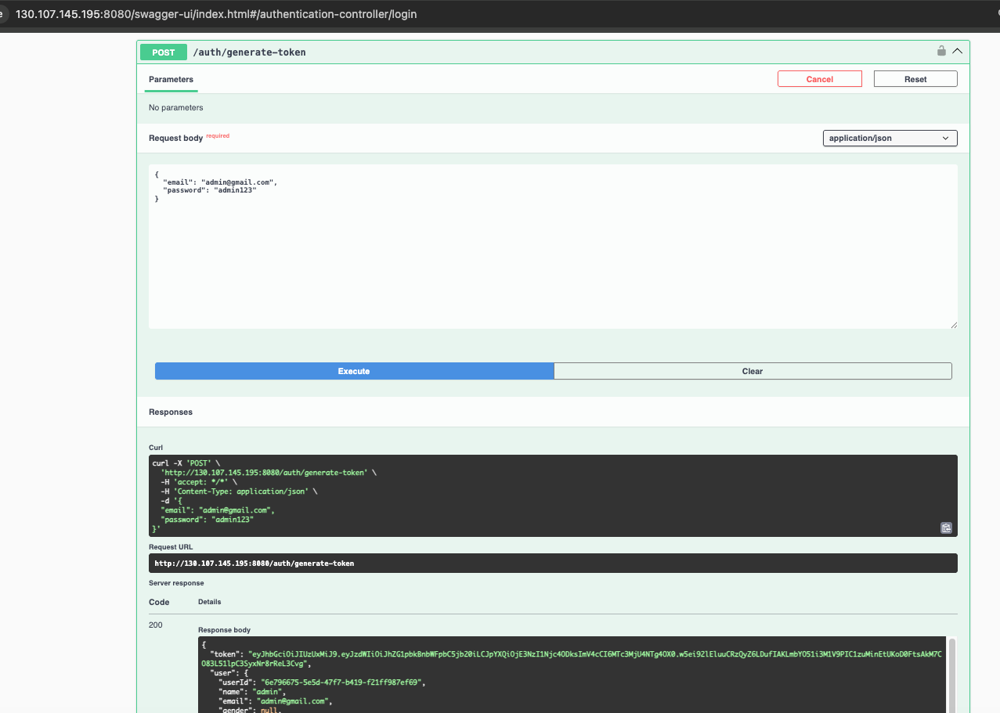

DOCKER IMP COMMANDS :

-> understanding the docker file commands :

FROM openJdk. -- DEFINES the base image
WORKDIR /usr/src/myapp.  - create target foldwer with this path
COPY . /usr/src/mmyapp.  - copy all from current folder to target folder
RUN javac Test.java
CMD ["java" ""filename].        --set default executable and parametres for executing this container.

-----------------------------------------------------------------------------
Sample with a service :

FROM openjdk
WORKDIR /usr/src/myapp
COPY . /usr/src/myapp/
CMD ["java","-jar", "jarFileName.jar" ]
EXPOSE 9898
-----------------------------------------------------------------------------

 ## Dockerizing the app : Steps to follow :

1. Add all dependency to docker-compose yaml
2. create dockerfile.
3. push the image to dockerhub : docker tag image-name username/reponametobe created
> docker push username/imagename :

> docker push taalib1705/electronicstorefull1.0

-- docker image link :sc3 https://hub.docker.com/repository/docker/taalib1705/electronicstore1.0/general

Also the bundled version with DB the imageName-> taalib1705/electronicstorefull1.0

========================================================================================

## Deployiong to Azure VM ~ S3:

1. create a new resource group -> create a new web app -> give image name from dockerhub ->  create

> this can be done using Azure VM -> we created one see sc and connected it with our local ssh client terminal

NOTE : for running logs check the note under azure :
post running this on azure VM -> running the app :

1. > create the DB instance container  -> docker run -d --name electronic-store-mysql --network electronic-store-network -p 3309:3306 -e MYSQL_ROOT_PASSWORD=root -e MYSQL_DATABASE=electronicstore -e MYSQL_USER=appuser -e MYSQL_PASSWORD=apppass mysql:8.0 --default-authentication-plugin=mysql_native_password

2. > run our application image container.
   -> docker run -d --name electronic-store-app --network electronic-store-network -p 8080:8080 -e SPRING_DATASOURCE_URL=jdbc:mysql://electronic-store-mysql:3306/electronicstore -e SPRING_DATASOURCE_USERNAME=appuser -e SPRING_DATASOURCE_PASSWORD=apppass taalib1705/electronicstore1.0

- > run docker ps to check the status of runing container..

NOTE : for issue with image type we rebuilded the image with a different platform :
taalibzama@Taalibs-Mac-mini demo-of-electronic-store % docker tag demo-of-electronic-store-app taalib1705/electronicstorefull1.0                  
taalibzama@Taalibs-Mac-mini demo-of-electronic-store % docker buildx build --platform linux/amd64 -t taalib1705/electronicstorefull1.0:latest --push

===============================================================

3. >Post startup and successfully running docker -> check the IP details in azure -> SC 4

4. >add inbound port access to our application port : 8080 - allow it - check sc 5
-> Now access the application on publicIP : port (check SC6)  -> http://130.107.145.195:8080/

4. >check the swaggger ui running on public port of our azure VM ->  sc6

   
- This completes the deployment of our application on azure VM using docker and we can access it using public IP and port 8080 and also the swagger ui is working fine on azure VM.
===========================================================================

# further check if our generate token api is working fine with default admin user :
{
"email" : "admin@gmail.com",
"password" : "admin123"
}

======================================================
