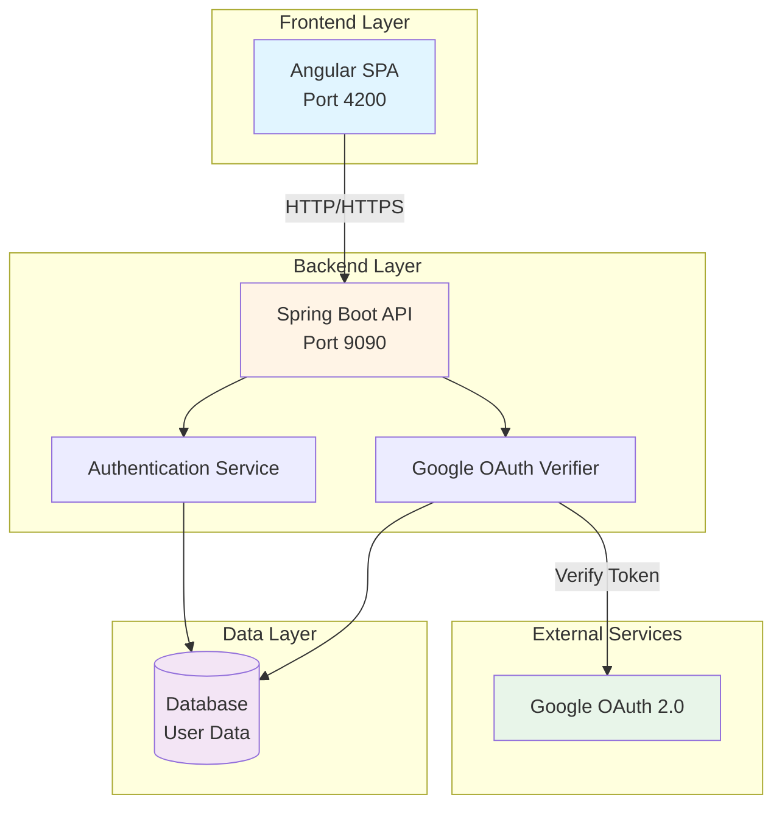
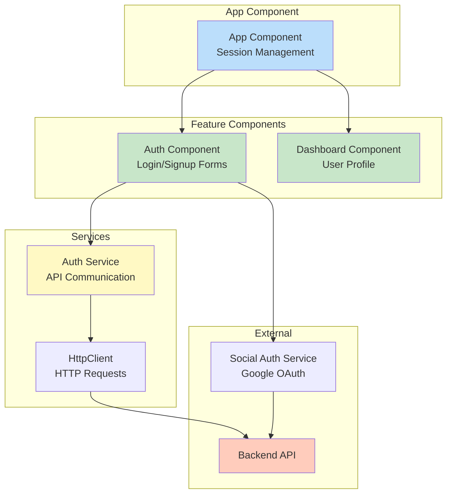
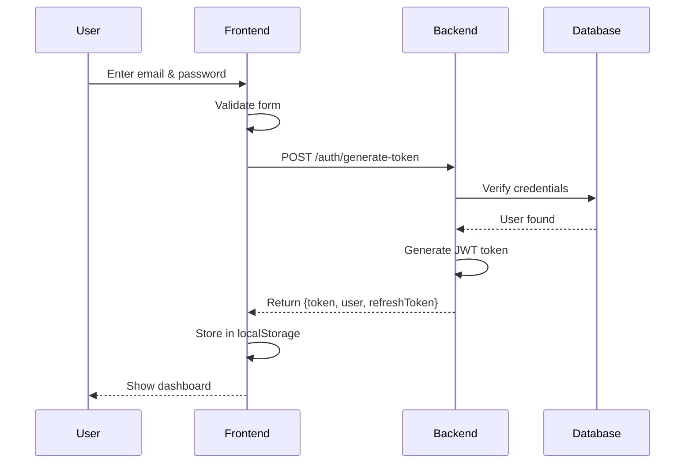
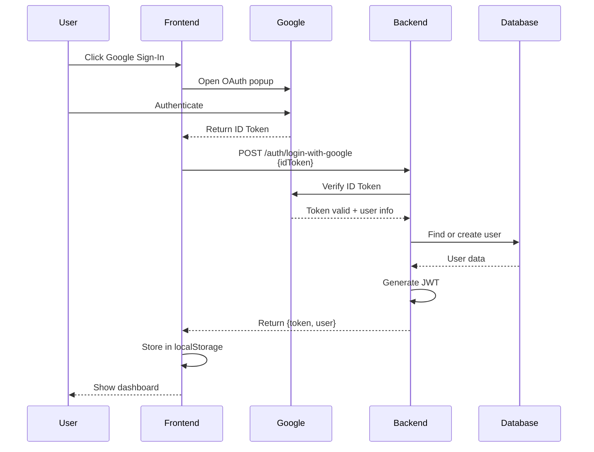
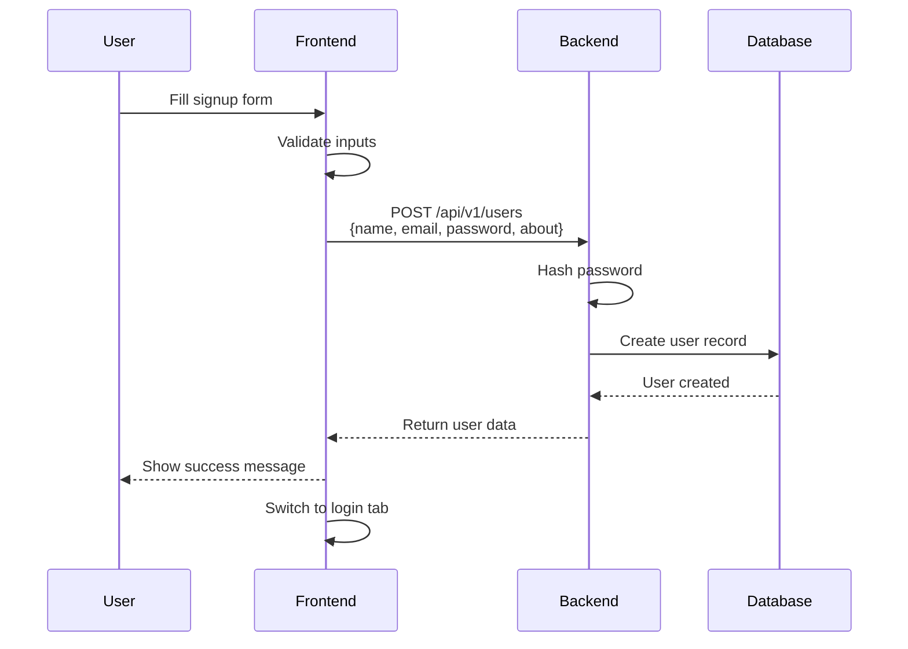
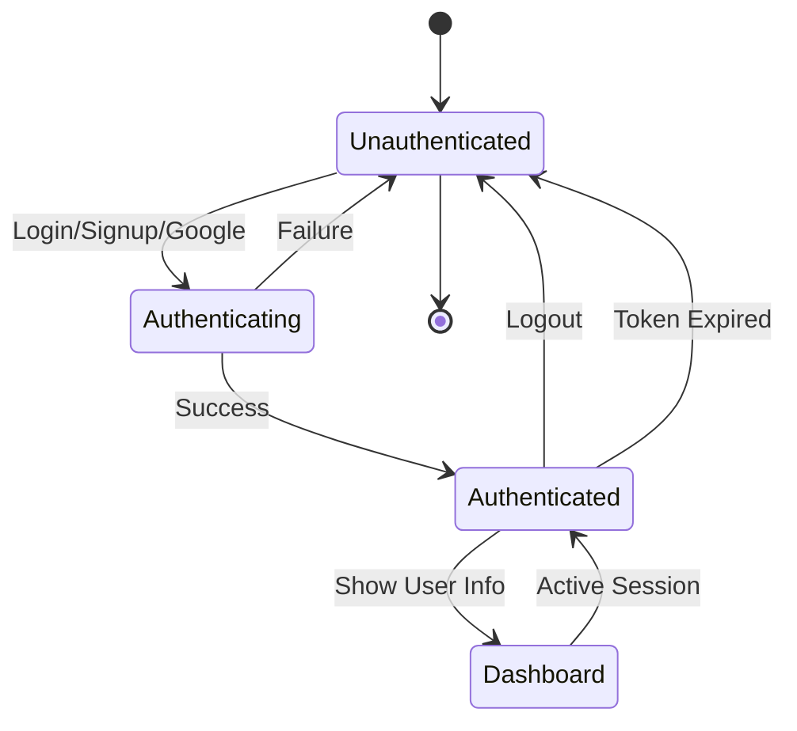
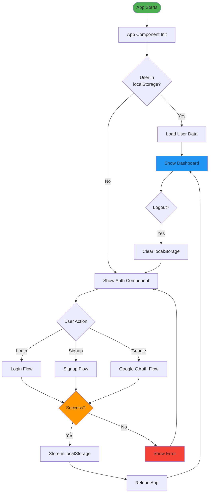
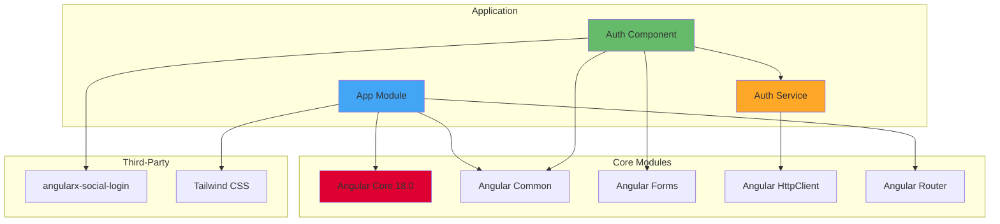
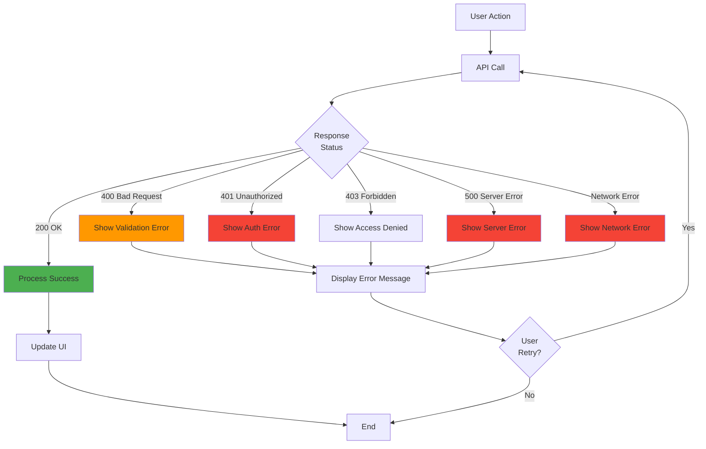

# System Architecture Diagrams

This file contains Mermaid diagrams that can be rendered in GitHub, VS Code, or any Mermaid-compatible viewer.

## 1. High-Level System Architecture



## 2. Component Architecture



## 3. Authentication Flow - Email/Password



## 4. Google OAuth Flow



## 5. User Registration Flow



## 6. Data Flow Architecture

```mermaid
graph LR
    subgraph "Presentation"
        LOGIN[Login Form]
        SIGNUP[Signup Form]
        DASH[Dashboard]
    end
    
    subgraph "Service Layer"
        AUTH_SVC[Auth Service]
        STORAGE[localStorage]
    end
    
    subgraph "API Layer"
        EP1[/auth/generate-token]
        EP2[/auth/login-with-google]
        EP3[/api/v1/users]
    end
    
    subgraph "Backend"
        JWT[JWT Service]
        USER[User Service]
        OAUTH[OAuth Service]
    end
    
    LOGIN --> AUTH_SVC
    SIGNUP --> AUTH_SVC
    AUTH_SVC --> EP1
    AUTH_SVC --> EP2
    AUTH_SVC --> EP3
    AUTH_SVC --> STORAGE
    EP1 --> JWT
    EP2 --> OAUTH
    EP3 --> USER
    STORAGE --> DASH
    
    style LOGIN fill:#e3f2fd
    style SIGNUP fill:#e3f2fd
    style DASH fill:#e3f2fd
    style AUTH_SVC fill:#fff3e0
    style JWT fill:#f3e5f5
    style USER fill:#f3e5f5
    style OAUTH fill:#f3e5f5
```

## 7. State Management Flow



## 8. Component Lifecycle



## 9. Module Dependencies



## 10. Error Handling Flow



---

## How to View These Diagrams

### Option 1: GitHub
- Push this file to GitHub
- Diagrams will render automatically

### Option 2: VS Code
- Install "Markdown Preview Mermaid Support" extension
- Open this file and preview

### Option 3: Online Viewer
- Visit https://mermaid.live/
- Copy and paste diagram code

### Option 4: IntelliJ IDEA
- Install "Mermaid" plugin
- Diagrams will render in markdown preview
